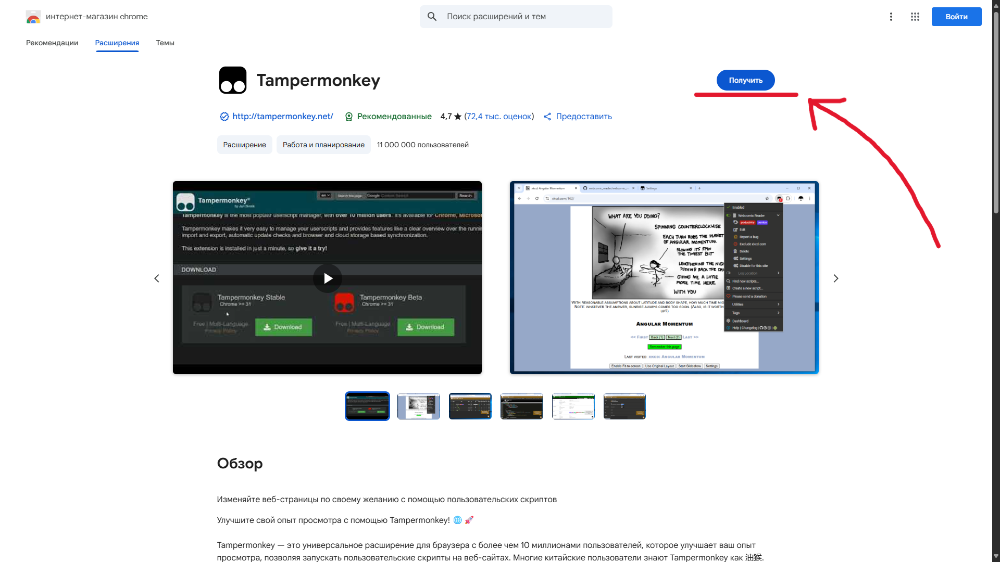
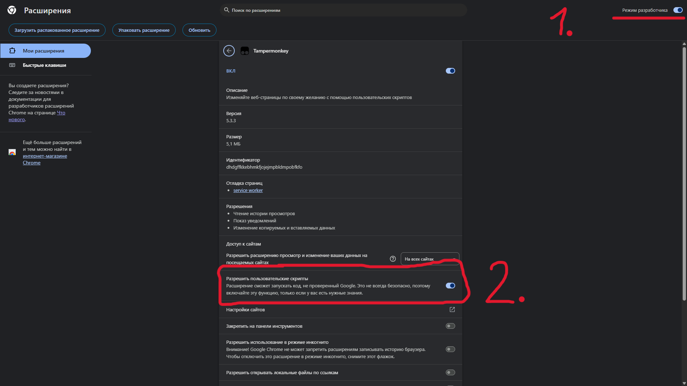

   
# TBL Experience

  
-yellow?style=flat)

## Описание
Данный скрипт, для Tampermonkey, был создан, чтобы передать опыт использования TBL пользователям браузеров.

**Разработчик:** G02m0n1k  

Чат проекта:  

## Установка

[Ссылка для установки](https://raw.githubusercontent.com/G02m0n1k/TBLE/refs/heads/main/dist/TBLE.user.js) через Tampermonkey

Я еще не установил расширение Tampermonkey

 <b>1. Откройте подходящий вам магазин расширений и установите Tampermonkey</b> 
<a href="https://addons.mozilla.org/en-US/firefox/addon/tampermonkey">> Firefox</a> 
<a href="https://chromewebstore.google.com/detail/tampermonkey/dhdgffkkebhmkfjojejmpbldmpobfkfo">> Chromium (Chrome, Vivaldi, Я.Браузер и т.д.)</a> 
<a href="https://microsoftedge.microsoft.com/addons/detail/tampermonkey/iikmkjmpaadaobahmlepeloendndfphd">> Edge</a> 
<a href="https://addons.opera.com/en/extensions/details/tampermonkey-beta/">> Opera</a> 
<a href="https://apps.apple.com/app/tampermonkey/id6738342400">> Safari (платно)</a> 
  

В браузерах, в списке расширений, необходимо будет включить "Режим разработчика", а некоторых, также потребуется включить пункт "Разрешить пользовательские скрипты" именно для Tampermonkey (фото ниже)

 
 <b>2. Установите TBL Experience по <a href="https://raw.githubusercontent.com/G02m0n1k/TBLE/refs/heads/main/dist/TBLE.user.js">этой ссылке</a></b> 
 <b>3. Перезагрузите страницу <a href="https://twitblit.ru">Twitblit</a></b> 
 <b>4. Готово! :D</b>  

## Приятного пользования

Свое мнение и пожелание можете оставить в чате проекта:  
